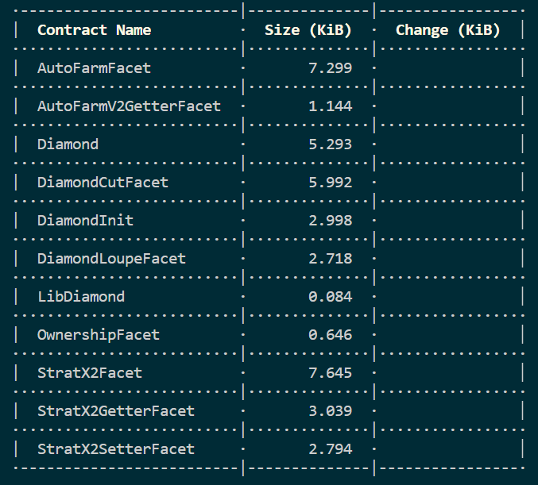
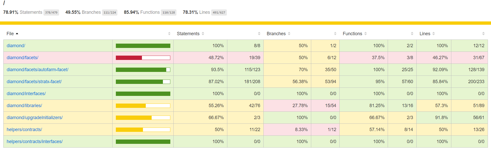

# Autofarm-Diamond Project

## Project Description

- This is a simple example implementation for EIP-2535 Diamond Standard. To learn about other implementations go here: <https://github.com/mudgen/diamond>

- To view the changes of original contracts with diamond implementation [click here](https://github.com/Shivansh070707/AutoFarm-Diamond-Standard/blob/e3dd4e28a6504794991b73adc16d1c4c299ad24d/docs/changes.md)

- To learn about the contract flow between autofarm and strat , refer to the [docs](https://github.com/Shivansh070707/AutoFarm-Diamond-Standard/blob/e3dd4e28a6504794991b73adc16d1c4c299ad24d/docs/AutoFarm%20-%20Diamond%20Implementation.pdf)

- The DApp (Decentralised Application) was designed with the purpose of optimising DeFi (Decentralised Finance) users yields as they interact with the other DApps in the DeFi space.
- Reference -<https://autofarm.gitbook.io/autofarm-network/>

---

## Technologies used

- solidity compiler version : `0.8.17`
- [Hardhat](https://hardhat.org/) smart contracts architecture
- [OpenZeppelin contracts](https://openzeppelin.com/)
- [chai](https://www.chaijs.com/) for testing
- [solidity-coverage](https://github.com/sc-forks/solidity-coverage) for generating code coverage
- [truffle dashboard](https://trufflesuite.com/docs/truffle/how-to/use-the-truffle-dashboard/) for deplyment of the smart contracts

---

## A typical top-level directory layout

```shell
.
├── build                 # deployed addresses and the ABI of the smart contract (scripts/deploy.ts)
├── contracts            # smart contracts solidity files
├── scripts               # deployment scripts (deploy.ts) and other tasks
├── test                  # test scripts
├── .env.example          # environment variables template
├── .gitignore
├── hardhat-config.ts     # hardhat configuration
├── package.json          # project details and dependencies
├── README.md

```

---

## Instructions and hardhat commands

### Installation

1- Clone this repo:

```shell
git clone https://github.com/Shivansh070707/AutoFarm-Diamond-Standard
```

2- Install the autofarm project dependencies.

This will install the packages mentioned inside the `package.json` file.:

```shell
cd AutoFarm-Diamond-Standard
npm install or yarn install
```

### Deployment

- Create the `.env` file following the `.env.example` file and fill in the contents. The values for the `ALCHEMY_API_KEY` can be obtained from the [Alchemy](https://www.alchemy.com/) website. If you don't have an account, you can create one for free.

  ```shell
  cp .env.example .env
  ```

  Else, you can comment out the places in the `hardhat.config.ts` file where the `ALCHEMY_API_KEY` is used, to be able to compile the smart contracts.

- Compile the smart contracts. \
  This will compile the smart contract files using the specified soilidity compiler in `hardhat.config.ts`.

  ```shell
  npx hardhat compile
  ```

- Instantiate the hardhat local node.

  ```shell
  npx hardhat node
  ```

- Run the autofarm project tests using the local node.

  ```shell
  npx hardhat test --network localhost
  ```

- Test Single files with typecheck:

  ```shell m
  npx hardhat test ./test/autofarm.test.ts --network localhost --typecheck
  ```

  ```shell
  npx hardhat test ./test/facet.test.ts --network localhost --typecheck
  ```

  ```shell
  npx hardhat test ./test/stratx2.test.ts --network localhost --typecheck
  ```

- Generate the code coverage report. \
  After generating the report, you can open the `coverage/index.html` file to see the results.

  ```shell
  npx hardhat coverage
  ```

- Deployment of the smart contracts.

  There are two ways of deploying the smart contracts:

  - Using private keys:

    The private key needs to be pasted in the .env file and the `accounts` property in the `networks` properties in the `hardhat.config.ts` file needs to be uncommented for the network on which the smart contracts need to deployed, as follows.

    ```shell
    goerli: {
      url: `https://eth-goerli.g.alchemy.com/v2/${ALCHEMY_API_KEY}`,
      accounts: [`0x${PRIVATE_KEY}`],
      chainId: 5,
    },
    ```

  - Without using private keys:

    This lets you deploy the contracts without the need of pasting the private key anywhere in the project and is the preferred way of deployment.

    - Install truffle globally

      ```shell
      npm install -g truffle
      ```

    - Run the truffle dashboard

      ```shell
      truffle dashboard
      ```

    - The browser will open up and then you have to connect with the MetaMask extension. Select the preferred network and the account to deploy the smart contract.

#### Deploy Autofarm

- for deploying autofarm diamond you need to modify the variables in `./scripts/autofarm.deploy.ts`

  ```shell
    npx hardhat run ./scripts/autofarm.deploy.ts --network <NETWORK>
  ```

#### Deploy StratX2

- for deploying stratx2 diamond you need to modify the variables in `./scripts/stratx2.deploy.ts`

  ```shell
   npx hardhat run ./scripts/stratx2.deploy.ts --network <NETWORK>
  ```

- `<NETWORK>` can be `localhost`, `goerli`, `mainnet` or any other network that is supported and defined in the `hardhat.config.ts`.

- If the deployment uses the truffle dashboard method, then, switch to the browser and sign the deployment transactions from the MetaMask extension. For the deployment of the `initFunction.ts`, there will be **multiple transactions** that need to be signed via Metamask.

- Otherwise, if the deployment uses the private key, the transactions will be signed automatically and will be shown in the terminal.

- After the successful deployment of the smart contracts, a `build` folder comprising the addresses and the ABIs of the deployed smart contracts will be generated.

---

## Smart contracts size

- To generate the sizes of the smart contracts.

  ```shell
  npx hardhat size-contracts
  ```

  

---

## Code coverage

- To generate the code coverage report for the test cases of the smart contracts.

  ```shell
  npx hardhat coverage
  ```

  

---

## Facet Information

- The contracts/diamond/Diamond.sol file shows an example of implementing a diamond.

- The contracts/diamond/facets/DiamondCutFacet.sol file shows how to implement the diamondCut external function.

- The contracts/diamond/facets/DiamondLoupeFacet.sol file shows how to implement the four standard loupe functions.

- The contracts/diamond/libraries/LibDiamond.sol file shows how to implement Diamond Storage and a diamondCut internal function.

- The scripts/autofarm.deploy.ts file shows how to deploy a Autofarm diamond.

- The scripts/stratx2.ts & scripts/stratx2.pcs.ts file shows how to deploy a strat diamond.

- The test/facet.test.ts file gives tests for the diamondCut function and the Diamond Loupe functions.

- The test/autofarm.test.ts file gives tests for the autofarm facets.

- The test/stratx2.test.ts file gives tests for the stratx2 facets.

---

## How to Get Started Making Your Diamond

1- Reading and understand [EIP-2535 Diamonds](https://github.com/ethereum/EIPs/issues/2535).

2- Use a diamond reference implementation. You are at the right place because this is the README for a diamond reference implementation.

- This diamond implementation is boilerplate code that makes a diamond compliant with EIP-2535 Diamonds.

- Specifically you can copy and use the [DiamondCutFacet.sol](https://github.com/Shivansh070707/AutoFarm-Diamond-Standard/blob/499675a256f7fe984987f423bd5e6c50841e5446/contracts/diamond/facets/DiamondCutFacet.sol) and [DiamondLoupeFacet.sol contracts](https://github.com/Shivansh070707/AutoFarm-Diamond-Standard/blob/499675a256f7fe984987f423bd5e6c50841e5446/contracts/diamond/facets/DiamondLoupeFacet.sol). They implement the diamondCut function and the loupe functions.

- The [Diamond.sol](https://github.com/Shivansh070707/AutoFarm-Diamond-Standard/blob/499675a256f7fe984987f423bd5e6c50841e5446/contracts/diamond/Diamond.sol) contract could be used as is, or it could be used as a starting point and customized. This contract is the diamond. Its deployment creates a diamond. It's address is a stable diamond address that does not change.

- The [LibDiamond.sol](https://github.com/Shivansh070707/AutoFarm-Diamond-Standard/blob/499675a256f7fe984987f423bd5e6c50841e5446/contracts/diamond/libraries/LibDiamond.sol) library could be used as is. It shows how to implement Diamond Storage. This contract includes contract ownership which you might want to change if you want to implement DAO-based ownership or other form of contract ownership. Go for it. Diamonds can work with any kind of contract ownership strategy. This library contains an internal function version of diamondCut that can be used in the constructor of a diamond or other places.

### Calling Diamond Functions

In order to call a function that exists in a diamond you need to use the ABI information of the facet that has the function.

Here is an example that uses ethers.js:

```javascript
let myUsefulFacet = await ethers.getContractAt(
  facetName,
  diamondDeployedAddress
);
```

```javascript
string result = MyUsefulFacet(address(diamondContract)).getResult()
```

---

### Useful Links

1.[Introduction to the Diamond Standard, EIP-2535 Diamonds](https://eip2535diamonds.substack.com/p/introduction-to-the-diamond-standard) \
2.[EIP-2535 Diamonds](https://github.com/ethereum/EIPs/issues/2535) \
3.[Understanding Diamonds on Ethereum](https://dev.to/mudgen/understanding-diamonds-on-ethereum-1fb) \
4.[Solidity Storage Layout For Proxy Contracts and Diamonds](https://medium.com/1milliondevs/solidity-storage-layout-for-proxy-contracts-and-diamonds-c4f009b6903) \
5.[New Storage Layout For Proxy Contracts and Diamonds](https://medium.com/1milliondevs/new-storage-layout-for-proxy-contracts-and-diamonds-98d01d0eadb) \
6.[Upgradeable smart contracts using the Diamond Standard](https://hiddentao.com/archives/2020/05/28/upgradeable-smart-contracts-using-diamond-standard) \
7.[buidler-deploy supports diamonds](https://github.com/wighawag/buidler-deploy/) 8.[Introduction to AutoFarm](https://medium.com/stakingbits/introduction-to-autofarm-on-the-binance-smart-chain-bc285203710c)

---

## Author

Shivansh Shrivastava

---

### License

MIT license. See the license file. Anyone can use or modify this software for their purposes.
